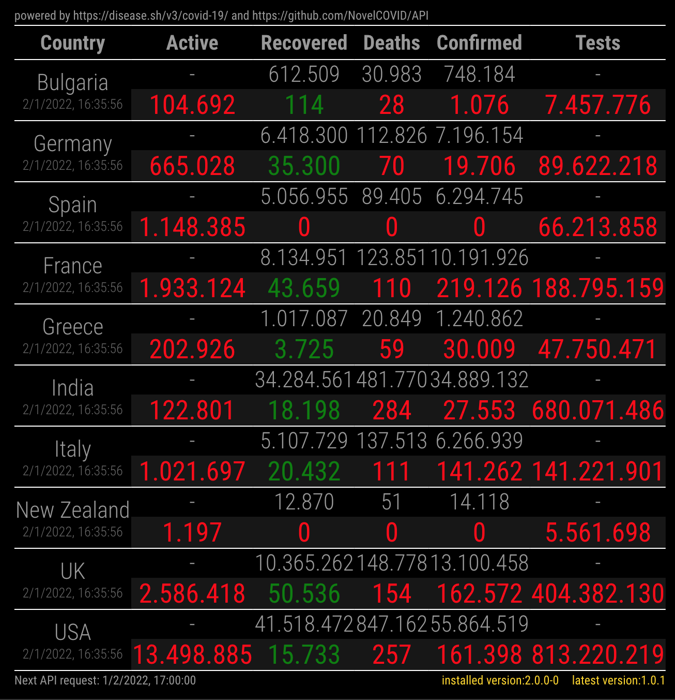

# MMM-covid19
Magic Mirror Module to display stats on Covid19.  
Data is provided by _https://disease.sh/v3/covid-19_

The data shown in the table displays the total numbers (top) and the difference calculated on the last 24 hours of available data. Reference timezone is UTC.

## installation
This 3rd party module install just like any other.  
This Magic Mirror Forum thread describe a step-by-step procedure to install: [How to add modules. For absolute beginners.](https://forum.magicmirror.builders/topic/4231/how-to-add-modules-for-absolute-beginners?_=1622723520331)

Check the configuration documentation below to ensure all set-up is done correctly.


## configuration
the default configuration looks like this:
```js
{
  disabled: false,
  module: "MMM-covid19",
  position: "bottom_center",
  config: {
    countryCodes: ['DE', 'IT'],
    updateInterval: 24 * 60 * 60 * 1000,
    useScheduler: false,
    schedulerConfig: '0 0 */12 * * */1',
    yesterday: true,
    locale: 'en-US'
  },
}
```

- `countryCodes`: an Array of ISO2 values.  
A list can be obtained at this url: https://api.covid19api.com/countries 

- `updateInterval`: a value expressed in milliseconds to be used to refresh the numbers.  
Its value is only used when `useScheduler=false`.  
Its default values invokes an API call every 24 hours, starting from the first invocation date and time.  

- `useScheduler`: a boolean value (`true` or `false`).  
Set to `true` it uses a _cron_ like approach to refresh the data. It uses [`node-schedule`](https://github.com/node-schedule/node-schedule), in order to be able to use this option, you need to run `npm install` or `npm ci`.  

- `schedulerConfig`: a valid [`node-schedule`](https://github.com/node-schedule/node-schedule) configuration as a string or as an object.  
Its default value execute an API call _twice a day every day ad 12am and 12pm UTC time_.

- `yesterday`: a boolean value (`true` or `false`).  
Set to `true`shows data concerning the day before, `false`it shows data about the current day

- `locale`: a string representing the locale version to use to format date and numbers  
Examples of valid language codes include `en`, `en-US`, `fr`, `fr-FR`, `es-ES`, etc.
  

## screenshots


