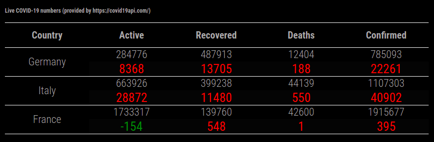

# MMM-covid19
Magic Mirror Module to display stats on Covid19.  
Data is provided by _https://covid19api.com/_

The data shown in the table displays the total numbers (top) and the difference calculated on the last 24 hours of available data. Reference timezone is UTC.

## installation
This 3rd party module install just like any other.  
This Magic Mirror Forum thread describe a step-by-step procedure to install: [How to add modules. For absolute beginners.](https://forum.magicmirror.builders/topic/4231/how-to-add-modules-for-absolute-beginners?_=1622723520331)

Check the configuration documentation below to ensure all set-up is done correctly.


## configuration
the default configuration looks like this:
```js
{
  disabled: false,
  module: "MMM-covid19",
  position: "bottom_center",
  defaults: {
    countryCodes: ['DE', 'IT'],
    world: false,
    live: true,
    updateInterval: 24 * 60 * 60 * 1000,
    useScheduler: false,
    schedulerConfig: '0 0 */12 * * */1'
  },
}
```

- `countryCodes`: an Array of ISO2 values.  
A list cen be obtain at this url: https://api.covid19api.com/countries

- `world`: a boolean value (`true` or `false`).  
Set to `true`it shows the world total numbers, it does not otherwise.

- `live`: a boolean value (`true` or `false`).  
Set to `true` it shows the total numbers per country set in `countryCodes`, it does not otherwise.

- `updateInterval`: a number in milliseconds to be used to refresh the numbers. Its value is only used when `useScheduler=false`.  
Its default values invokes an API call every 24 hours from starting from the first one.

- `useScheduler`: a boolean value (`true` or `false`).  
Set to `true` it uses _cron_ like approach to refresh the data. It uses [`node-schedule`](https://github.com/node-schedule/node-schedule), in order to be able to use thi option, you need to run `npm install`

- `schedulerConfig`: a valid `node-schedule`configuration as a string or as an object.  
Its default value execute an API call _twice a day every day ad 12am and 12pm UTC time_.
  
  
The numbers shown are the delta between last day 00:00 UTC and the day before 00:00 UTC. The dates can be shown at the bottom of the list.

## screenshots


