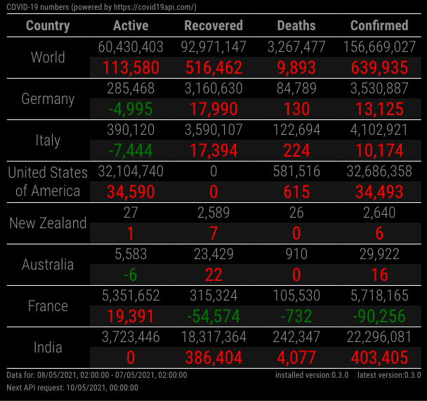

# MMM-covid19
Magic Mirror Module to display stats on Covid19.  
Data is provided by _https://covid19api.com/_

The data shown in the table displays the total numbers (top) and the difference between today's numbers and the day before numbers (bottom).

## configuration
```js
{
    disabled: false,
    module: "MMM-covid19",
    position: "bottom_center",
    config: {
        updateInterval: 1 * 60 * 60 *1000, // 1 hour
        countryCodes: ["DE", "IT", "ES"]
    }
}
```

## screenshots
