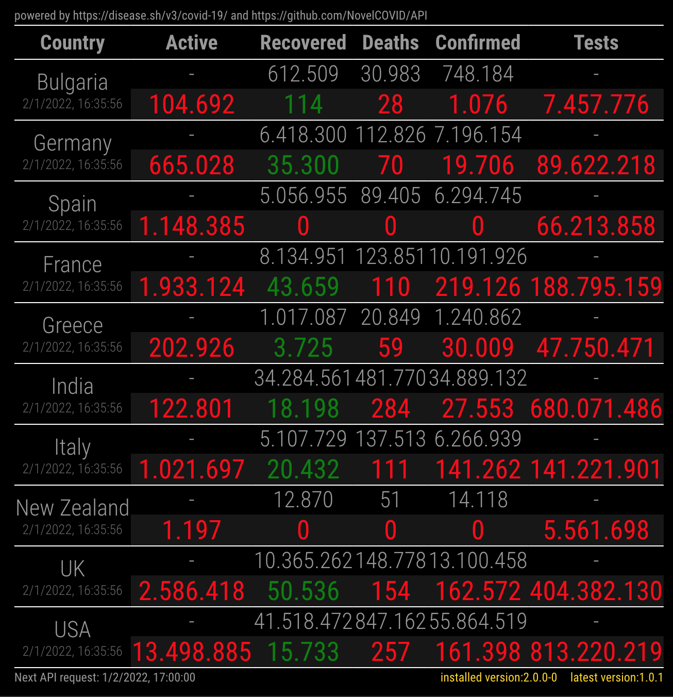

# MMM-covid19
用于显示 Covid19 统计数据的 Magic Mirror 模块。
数据由 _https://disease.sh/v3/covid-19_ 提供。

表格中显示的数据包含总数（顶部）以及根据过去 24 小时可用数据计算出的差值。参考时区为 UTC。

## installation (安装)
此第三方模块的安装方式与其他模块相同。
这个 Magic Mirror 论坛帖子详细描述了安装的逐步步骤：[How to add modules. For absolute beginners.](https://forum.magicmirror.builders/topic/4231/how-to-add-modules-for-absolute-beginners?_=1622723520331)

请检查下方的配置文档以确保所有设置均正确完成。


## configuration (配置)
默认配置如下所示：
```js
{
  disabled: false,
  module: "MMM-covid19",
  position: "bottom_center",
  config: {
    countryCodes: ['DE', 'IT'],
    updateInterval: 24 * 60 * 60 * 1000,
    useScheduler: false,
    schedulerConfig: '0 0 */12 * * */1',
    yesterday: true,
    locale: 'en-US'
  },
}
```

- `countryCodes`: ISO2 值的数组。
可以通过此 URL 获取列表：https://api.covid19api.com/countries 

- `updateInterval`: 用于刷新数据的毫秒值。
该值仅在 `useScheduler=false` 时生效。
默认值会从首次调用日期和时间起，每 24 小时调用一次 API。

- `useScheduler`: 布尔值 (`true` 或 `false`)。
设置为 `true` 时，将使用类似 _cron_ 的方式来刷新数据。它使用了 [`node-schedule`](https://github.com/node-schedule/node-schedule)，为了能够使用此选项，你需要运行 `npm install` 或 `npm ci`。

- `schedulerConfig`: 一个有效的 [`node-schedule`](https://github.com/node-schedule/node-schedule) 配置，可以是字符串或对象。
其默认值会在 _每天 UTC 时间凌晨 12 点和中午 12 点调用两次 API_。

- `yesterday`: 布尔值 (`true` 或 `false`)。
设置为 `true` 显示前一天的数据，`false` 则显示当天的数据。

- `locale`: 代表用于格式化日期和数字的区域设置字符串。
有效语言代码示例包括 `en`, `en-US`, `fr`, `fr-FR`, `es-ES` 等。


## screenshots (截图)

